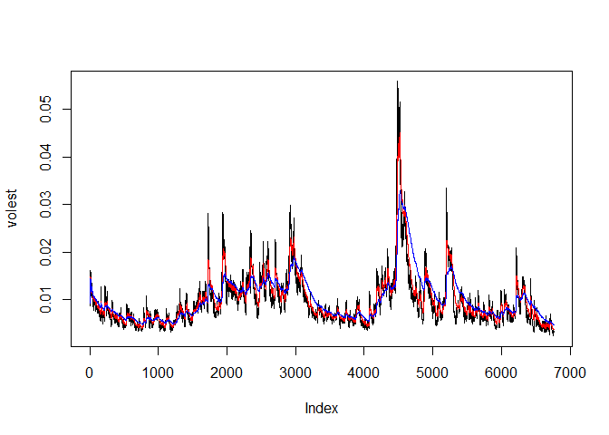

# MSDS 6306 Lecture Assignment 11 S&P 500 Volatility Analysis
Brian Coari  
November 4, 2017  


## Introduction

This analysis is to measure the volatility of the S&P 500 over time, and to guage the effects of measuring that volatility.
To perform this analysis we will take the records for all open stock trading days from Jan 1 1991 to Nov 3 2017, calculate the log returns of the S&P data we have collected, then calculating how much each entry differs from the standard deviation. We will then damped those differences by differing decay factors and plot the effects of theose differences.


```r
# Unit 11: Modeling Financial Data
# Uncomment and install packages if you don't have it
#install.packages("tseries")

# Description: Please fill out that this is for educational purposes and talk about what it's for!

library(tseries)
```

```
## Warning: package 'tseries' was built under R version 3.4.2
```

```r
## S&P 500 (^GSPC)
###    SNP - SNP Real Time Price. Currency in USD

# DONE: Download the data of SP500 '^gspc'.
SNPdata <- get.hist.quote('^gspc',quote="Close")
```

```
## 'getSymbols' currently uses auto.assign=TRUE by default, but will
## use auto.assign=FALSE in 0.5-0. You will still be able to use
## 'loadSymbols' to automatically load data. getOption("getSymbols.env")
## and getOption("getSymbols.auto.assign") will still be checked for
## alternate defaults.
## 
## This message is shown once per session and may be disabled by setting 
## options("getSymbols.warning4.0"=FALSE). See ?getSymbols for details.
```

```
## 
## WARNING: There have been significant changes to Yahoo Finance data.
## Please see the Warning section of '?getSymbols.yahoo' for details.
## 
## This message is shown once per session and may be disabled by setting
## options("getSymbols.yahoo.warning"=FALSE).
```

```
## time series ends   2017-11-03
```

```r
# DONE: Calculate the log returns, which is the subtraction of log(lag(SNPdata)) and log(SNPdata)
SNPret <- log(lag(SNPdata))-log(SNPdata)

# DONE: Calculate volatility measure that is to multiply sd(SNPret),sqrt(250), 100
SNPvol <- sd(SNPret) * sqrt(250) * 100
```


## Plot of Results
In the plots below we will print the volatility with the three different decay factors and color the lines according the the decay factor used. Decay Factor 10 = BLACK, Decay Factor 30 = RED, Decay Factor 100 = BLUE 


```r
## Define getVol function for volatility
getVol <- function(d, logrets) {
	var = 0
	lam = 0
	varlist <- c()

	for (r in logrets) {
		lam = lam*(1 - 1/d) + 1
	  var = (1 - 1/lam)*var + (1/lam)*r^2
		varlist <- c(varlist, var)
	}

	sqrt(varlist)
}

# Calculate volatility over entire length of series for various three different decay factors: 10 30. 100

# DONE: call getVol function with the parameters: 10,SNPret
volest <- getVol(10,SNPret)

# DONE: call getVol function with the parameters: 30,SNPret
volest2 <- getVol(30,SNPret)

# DONE: call getVol function with the parameters: 100,SNPret
volest3 <- getVol(100,SNPret)
# Plot the results, overlaying the volatility curves on the data, just as was done in the S&P example.
plot(volest,type="l")

# DONE: Add connected line segments for volest2 with the parameters: type="l",col="red"
lines(volest2,type="l", col="red")

# DONE: Add connected line segments for volest3 with the parameters: type="l",col="blue"
lines(volest3,type="l", col="blue")
```

<!-- -->

## Conclusion

There were many peaks in the volatility measure of the data, with the largest peaking appearing at around index 4700.
As the decay factors got larger, the volatility measured in the data set appeared to me "smoothed out", the peaks were not as high, most notably around the largest peak.

